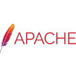

# 👋 Hey there! I'm Saad Ahmad (Ayyzenn)

### *A passionate DevOps enthusiast, Linux geek, and aspiring MLOps & System Administration expert!*

---
## 🚀 About Me

🎓 **Insturctor at FAST NUCES** | 💡 **DevOps & Linux Enthusiast** | 🔥 **Always Learning**

- 💡 Passionate about **DevOps, Linux, MLOps, and System Administration**
- 🔥 Always learning and growing, eager to take on new challenges
- 💻 Love working with **infrastructure, automation, and cloud technologies**
- 🎮 In my free time, you'll find me **gaming** or exploring **new tech**

---

## 🛠️ Tech Stack

### 💻 Programming Languages & Data Science

&nbsp;
&nbsp;
&nbsp;
&nbsp;
&nbsp;
&nbsp;
&nbsp;
&nbsp;
&nbsp;
&nbsp;
&nbsp;

### 🌐 Web Development

&nbsp;
&nbsp;
&nbsp;
&nbsp;
&nbsp;

### ☁️ Cloud & DevOps

&nbsp;
&nbsp;
&nbsp;
&nbsp;
&nbsp;
&nbsp;
&nbsp;
&nbsp;

### 🐧 Operating Systems & Tools

&nbsp;
&nbsp;
&nbsp;
&nbsp;
&nbsp;
&nbsp;
&nbsp;
&nbsp;
&nbsp;

### 🗄️ Databases & Big Data

&nbsp;
&nbsp;
&nbsp;

### 🛠️ Development Tools

&nbsp;
&nbsp;
&nbsp;
&nbsp;
&nbsp;

### 📝 Other Tools & Technologies

&nbsp;
&nbsp;
&nbsp;
&nbsp;
&nbsp;
&nbsp;

---

## 📊 GitHub Stats & Activity

---

## 🔥 Currently Learning

|                🐳 **Kubernetes**                |     ☁️ **Advanced Cloud Architecture**     |                     🤖 **MLOps**                      |       🔧 **Infrastructure as Code**        |
| :--------------------------------------------: | :---------------------------------------: | :--------------------------------------------------: | :---------------------------------------: |
| Container orchestration and cluster management | Multi-cloud strategies and best practices | Machine Learning operations and deployment pipelines | Advanced Terraform and Ansible automation |

---

## 💼 What I'm Working On

🚀 **Building scalable DevOps pipelines and automation scripts**  
📚 **Contributing to open-source projects**  
🎯 **Exploring cloud-native technologies and microservices architecture**  
🔐 **Learning advanced security practices for infrastructure**

---

## 💌 Connect with Me

---

### 💭 *"They call us dreamers… But we are the ones who don't sleep…!!"*

---

⭐️ From [@ayyzenn](https://github.com/ayyzenn)

