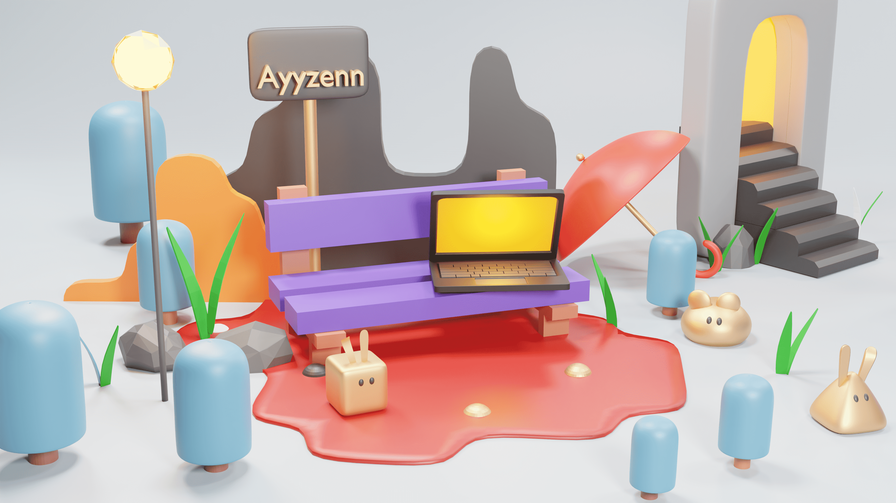

<!--  -->

<h1 align="center">Hey there! 👋 I'm Saad Ahmad (Ayyzenn)</h1>

  <em>A passionate DevOps enthusiast, Linux geek, and aspiring MLOps & System Administration expert!</em>

---

### 🚀 About Me

- 🎓 Student at **FAST NUCES**
- 💡 Passionate about **DevOps, Linux, MLOps, and System Administration**
- 🔥 Always learning and growing, eager to take on new challenges
- 💻 Love working with **infrastructure, automation, and cloud technologies**
- 🎮 In my free time, you'll find me **gaming** or exploring **new tech**

---

### 🛠️ Tech Stack

  &nbsp;
  &nbsp;
  &nbsp;
  &nbsp;
  &nbsp;
  &nbsp;
  &nbsp;
  &nbsp;
  &nbsp;
  &nbsp;
  &nbsp;
  &nbsp;
  &nbsp;
  &nbsp;
  &nbsp;

---

### 📊 GitHub Stats & Streak

  

---

### 📫 Connect with Me

- 🌐 [Portfolio](https://ayyzenn.dev)
- 💼 [LinkedIn](https://www.linkedin.com/in/ayyzenn/)
- 🐦 [Twitter](https://twitter.com/ayyzenn)
- 📧 [Email](mailto:your.email@example.com)

---

🔥 _"Technology is best when it brings people together!"_ 🔥
